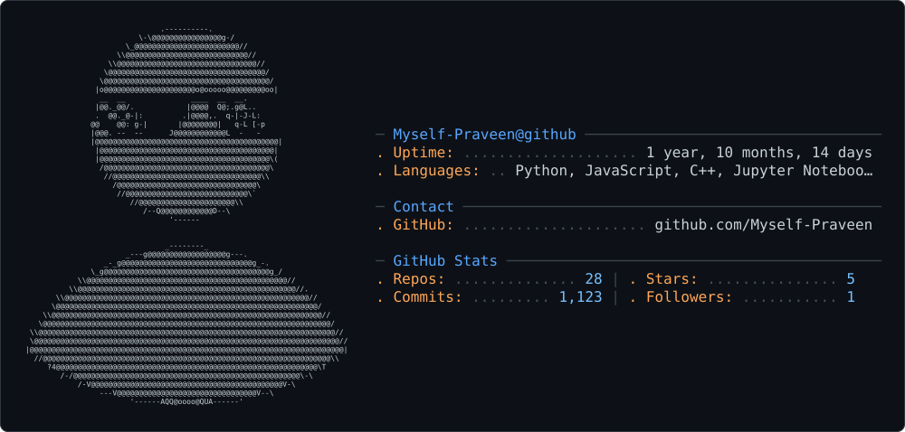

<picture>
  <source media="(prefers-color-scheme: dark)" srcset="dark_mode.svg" />
  <source media="(prefers-color-scheme: light)" srcset="light_mode.svg" />
  
</picture>

---

<!-- Typing Intro -->
<p align="center">
  
</p>

<p align="center">
  
</p>

---

```bash
$ cat about.md
```

- `role`      : B.Tech CSE, Pre-Final Year — IIITDM Kurnool
- `gpa`       : 8.00 / 10
- `stack`     : React · FastAPI · WebSockets · MongoDB
- `interests` : Machine Learning, NLP, Systems
- `cp`        : CodeChef 1525 (Rank 414) · Codeforces 1265 (Pupil) · LeetCode ~1700
- `status`    : building real-world, impact-driven AI solutions

---

```bash
$ ls skills/
```

**core/**
<p align="center">
  
  
  
  
  
  
</p>

**ml_nlp/**
<p align="center">
  
  
  
  
  
  
  
  
</p>

**web/**
<p align="center">
  
  
  
  
  
  
  
  
</p>

**infra/**
<p align="center">
  
  
  
  
  
  
  
  
</p>

---

```bash
$ ls projects/ --sort=featured
```

**./retriever** — Full-Stack Lost-and-Found System
```
stack   : React 19 · FastAPI · WebSockets · MongoDB · Redis · Gemini Vision API
metrics : 1K+ concurrent users | <50ms chat latency | 95%+ tagging accuracy
notes   : React-Leaflet geolocation, 5m precision
```
`repo` → [github.com/Myself-Praveen/Retriver](https://github.com/Myself-Praveen/Retriver)  ·  `demo` → [retriver-iota.vercel.app](https://retriver-iota.vercel.app/)

**./codesage** — AI-Powered Code Analysis Assistant
```
stack   : Python · LangChain · Ollama · FAISS · RAG Architecture
metrics : 10+ hrs/week saved | 50+ files indexed | 30% faster debugging
notes   : local-LLM CLI assistant for code refactoring
```
`repo` → [github.com/Myself-Praveen/Code_Sage](https://github.com/Myself-Praveen/Code_Sage)  ·  `demo` → [YouTube](https://www.youtube.com/watch?v=VU2RdymCOhA)

**./terminal-portfolio** — AI-Powered Terminal Portfolio
```
stack   : React.js · Node.js · Vercel Serverless · Google Gemini API
metrics : 5+ shell commands | +40% engagement | 100% prompt-injection mitigation
notes   : Gemini LLM behind a secure serverless proxy
```
`repo` → [github.com/Myself-Praveen/Portfolio](https://github.com/Myself-Praveen/Portfolio)  ·  `demo` → [praveen7928.vercel.app](https://praveen7928.vercel.app)

---

```bash
$ git log --graph --stat
```

<div align="center">
  
</div>

<br/>

<div align="center">
  
</div>

---

```bash
$ cat achievements.log
```

- `[codechef]`   rating 1525 — rank 414, Starters 225 → [codechef.com/users/itz_praveen](https://www.codechef.com/users/itz_praveen)
- `[codeforces]` rating 1265 — Pupil → [codeforces.com/profile/Itz_praveen](https://codeforces.com/profile/Itz_praveen)
- `[leetcode]`   rating ~1700 → [leetcode.com/u/itz_praveen](https://leetcode.com/u/itz_praveen/)
- `[nptel]`      Generative AI — Elite Silver, top 5% nationwide → [certificate](https://drive.google.com/file/d/1h_r5VoYmn8_rPzZu8lOeccUlNnnPrA1i/view?usp=sharing)
- `[jee-mains]`  98.2 percentile — top 2% of 1.6M candidates
- `[datathon]`   6th / 50+ teams — DataWorks Club
- `[gcp]`        Google Campus Ambassador, IIITDM Kurnool — onboarded 100+ students

---

```bash
$ cat contact.sh
```

<p align="center">
  <a href="https://www.linkedin.com/in/itz-praveen-mishra/">
    
  </a>
  <a href="mailto:praveen104685@gmail.com">
    
  </a>
  <a href="https://github.com/Myself-Praveen">
    
  </a>
  <a href="https://praveen7928.vercel.app">
    
  </a>
</p>

---

<!-- Snake -->
<p align="center">
  
</p>

---

<p align="center">
  <code>// strong fundamentals. consistent learning. real-world impact.</code>
</p>

<p align="center">
  
</p>
